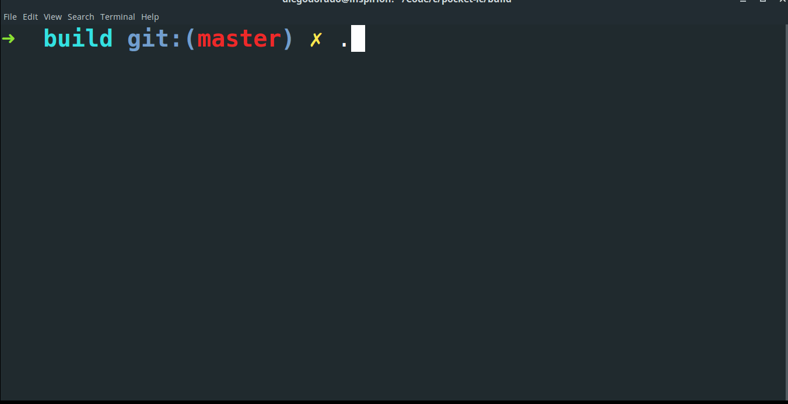

# pocket livecoding

**NOTE: WIP plenty of bugs**

A minimal setup of bytebeat that could run on microcontrollers like an atmega328

### Building

```bash
mkdir build
cd build
cmake ..
cmake --build .
```

### Running
Inside your build directory, call `./pockeLC`

The parser is initialized with `sin(t*440*6.28/44100)`  
Write something else, like `sin(t^2%100)` and hit `ctrl+E` to evaluate.  
When you are done, hit `ctrl+Q` to quit.



### One-liner build and run

Inside your build directory

```bash
cmake .. && cmake --build . && ./pockeLC
```

Then you can run it calling `./pockeLC` inside your build directory.


### Thanks to
  * [@codeplea](https://github.com/codeplea) for his Math Expression Parsing [tinyexpr](https://github.com/codeplea/tinyexpr)
  * [@antirez](https://github.com/antirez) for his small text editor [kilo](https://github.com/antirez/kilo)
